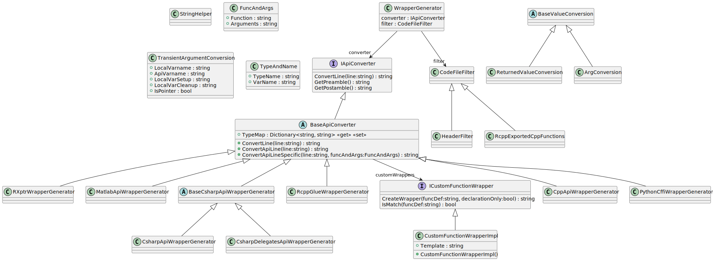

# Introduction

The codebase [Uchronia - time series handling for ensembles simulations and forecasts in C++](https://github.com/csiro-hydroinformatics/uchronia-time-series/) comprises a C++ core, and a C Application Programming Interface with Python, R, Matlab (and other) bindings. This is part of a [software stack for streamflow forecasting](https://github.com/csiro-hydroinformatics/streamflow-forecasting-tools-onboard). Some elements of the software stack similar to Uchronia have large C APIs. Even with a very stable C API (and they often were not at some point), it is mind-numbing, inefficient and bug-prone to generate [language bindings (glue code)](https://en.wikipedia.org/wiki/Language_binding) manually.

What I am writing about in this post is utility code for [interoperability code generation](https://github.com/csiro-hydroinformatics/c-api-wrapper-generation) that grew out of scientific software, and perhaps should have advertised in its own right.

## History

In 2014 after settling for C++ for a modelling core. I had R, Matlab and Python users, some need to interop with C# code. And some constraints on using different C++ compilers in the stack. So I decided on designing C APIs, the _lingua franca_ of in-process interop. I had some prior exposure to the Mono C core and interop with R. But not extensive first hand.

My first port of call for glue code was a no-brainer: [SWIG](https://www.swig.org/), which I first encountered in an internship in... 1997. I did not document my tribulations in details, but I encountered many difficulties when testing feasibility. Basically, I concluded that SWIG was just not a good fit for a C API like mine, especially one with opaque pointers (`void*`).

There were other offering for code generation for R, or Python. But apart from SWIG, I do not recall locating any suitable glue code generation for multiple target languages. I may revisit in more details the tribulations in another post, but this was the reason for the inception of [c-api-wrapper-generation](https://github.com/csiro-hydroinformatics/c-api-wrapper-generation).

# Glue code generation - context and review

## Foreword - Google search

Before starting this post, I wanted to check out what was the state of play out there and I was googling using the terms "generate bindings for a C API". Our [c-api-wrapper-generation](https://github.com/csiro-hydroinformatics/c-api-wrapper-generation) was coming up in the first few items. I thought Google was biasing the search given the wealth of information it has, I mean, come on, there must be thousands of similar endeavours out there. No way.

But, after some friends help and simulating searches from another geolocation, it seems Google is not cheating.

Not sure what to make of this yet. Oh, and searching "generating binding to a c api" instead of "generating bindings to a c api" wields a different list...

Anyway, a quick review before looking at [c-api-wrapper-generation](https://github.com/csiro-hydroinformatics/c-api-wrapper-generation).

## Brief scan of the state of the art

There is an excellent post [Automatic Language Bindings](https://floooh.github.io/2020/08/23/sokol-bindgen.html) by [Andrew Weissflog](https://github.com/floooh), which I recommend. Many statements and observations resonate with me. Related directly or indirectly to the post above (I intuit) I found [C2CS](https://github.com/bottlenoselabs/c2cs). I am very intrigued by their use of an abstract syntax tree (AST), I think. My approach was more crude (but perhaps pragmatic).

From the Rust community [this thread](https://users.rust-lang.org/t/creating-bindings-to-c-apis/23819) and [rust-bindgen](https://github.com/rust-lang/rust-bindgen)

A wealth of resources in [BindingCodeToLua](http://lua-users.org/wiki/BindingCodeToLua)

[pybind11](https://github.com/pybind/pybind11) is something I already looked at 3 years ago in [this post](https://medium.com/@jean.michel.perraud/using-pybind11-for-cross-module-c-api-bindings-5e50925d5684). I probably would have settled on it if it was purely about Python bindings, directly to the C++ code.

# Sample usage

Let's start with a sample usage. This is based on code that has evolved over time rather than something purely didactic, but should give an idea of the process. I may update this post if I reshape things to be more didactic.

## C API

The codebase uchronia has a [C API with functions](https://github.com/csiro-hydroinformatics/uchronia-time-series/blob/research/datatypes/include/datatypes/extern_c_api.h) such as:

```c++
	DATATYPES_API char** GetEnsembleDatasetDataIdentifiers(ENSEMBLE_DATA_SET_PTR dataLibrary, int* size);
	DATATYPES_API ENSEMBLE_FORECAST_TIME_SERIES_PTR CreateEnsembleForecastTimeSeries(date_time_to_second start, int length, const char* timeStepName);
	DATATYPES_API void GetTimeSeriesValues(TIME_SERIES_PTR timeSeries, double * values, int arrayLength);
```

The [low-level Python binding generated](https://github.com/csiro-hydroinformatics/uchronia-time-series/blob/research/bindings/python/uchronia/uchronia/wrap/uchronia_wrap_generated.py) from parsing this C API result in the following type of code. Note that opaque pointers such as `ENSEMBLE_DATA_SET_PTR` have corresponding higher level Python class equivalents such as `TimeSeriesLibrary`, even in the "low-level" glue code.

```python
def GetEnsembleDatasetDataIdentifiers_py(dataLibrary:'TimeSeriesLibrary'):
    dataLibrary_xptr = wrap_as_pointer_handle(dataLibrary)
    size = marshal.new_int_scalar_ptr()
    values = uchronia_so.GetEnsembleDatasetDataIdentifiers(dataLibrary_xptr.ptr, size)
    result = charp_array_to_py(values, size[0], True)
    return result

def CreateEnsembleForecastTimeSeries_py(start:datetime, length:int, timeStepName:str) -> 'EnsembleForecastTimeSeries':
    # glue code
def GetTimeSeriesValues_py(timeSeries:'TimeSeries', values:np.ndarray, arrayLength:int) -> None:
    # glue code
```

For information, the equivalent generated glue code for an R package `uchronia` are in files [src/rcpp_generated.cpp](https://github.com/csiro-hydroinformatics/uchronia-time-series/blob/research/bindings/R/pkgs/uchronia/src/rcpp_generated.cpp) and [R/uchronia-pkg-wrap-generated.r](https://github.com/csiro-hydroinformatics/uchronia-time-series/blob/research/bindings/R/pkgs/uchronia/R/uchronia-pkg-wrap-generated.r).

## Outline generating the python glue code

See the [wrapper generator c-api-wrapper-generation](https://github.com/csiro-hydroinformatics/c-api-wrapper-generation). The README.md has setup instructions for dotnet, if need be. 

There is a history behind why the conversion engine runs on .NET (and is written in C#), but I will not dwell on it in this post. Note that as of August 2022, even on Linux packages from the .NET ecosystem are readily available from Microsoft or even Ubuntu official package repositories.

If you have dotnet installed `dotnet --info` returns as of August 2022:

```text
.NET SDK (reflecting any global.json):
 Version:   6.0.302
 Commit:    c857713418

Runtime Environment:
 OS Name:     debian
 OS Version:  11
 OS Platform: Linux
 RID:         debian.11-x64
 Base Path:   /usr/share/dotnet/sdk/6.0.302/

global.json file:
  Not found

Host:
  Version:      6.0.7
  Architecture: x64
  Commit:       0ec02c8c96

.NET SDKs installed:
  6.0.302 [/usr/share/dotnet/sdk]

.NET runtimes installed:
  Microsoft.AspNetCore.App 6.0.7 [/usr/share/dotnet/shared/Microsoft.AspNetCore.App]
  Microsoft.NETCore.App 3.1.27 [/usr/share/dotnet/shared/Microsoft.NETCore.App]
  Microsoft.NETCore.App 6.0.7 [/usr/share/dotnet/shared/Microsoft.NETCore.App]
```

The codegen engine is C#, and we'll give an overview later. Compiling it is done like so:

```sh
cd ~/src/c-api-wrapper-generation
cd engine/ApiWrapperGenerator
dotnet restore ApiWrapperGenerator.sln
dotnet build --configuration Debug --no-restore ApiWrapperGenerator.sln
```

This will create the library `c-api-wrapper-generation/engine/ApiWrapperGenerator/bin/Debug/netstandard2.0/ApiWrapperGenerator.dll`, which contains the glue code generation engine. More details about it later, but for now we will walk through the usage first.

One handy interactive option to "script" binding generation for a library is the `F#` language. A script to generate the python bindings for uchronia is as follow. Note that most of the `F#` scripting code below is also (re-)used for other C APIs than `uchronia`'s

_Note: the following code is not yet publicly available. It should be in a revised post_

```fsharp
open System.Collections.Generic

#r "/home/per202/src/c-api-wrapper-generation/engine/ApiWrapperGenerator/bin/Debug/netstandard2.0/ApiWrapperGenerator.dll"
// #r @"C:\src\github_jm\c-api-wrapper-generation\engine\ApiWrapperGenerator\bin\Debug\netstandard2.0\ApiWrapperGenerator.dll"
open ApiWrapperGenerator

#load "gen_py_common.fsx"
open Gen_py_common
```

### gen_py_common.fsx

gen_py_common.fsx is a way to reuse boilerplate to generate code across several codebases. Typically, it includes a templated header with mostly similar functions with a few variations across use cases.

```fsharp
let prependHeaderTemplate = "##################
# 
# *** THIS FILE IS GENERATED ****
# DO NOT MODIFY IT MANUALLY, AS YOU ARE VERY LIKELY TO LOSE WORK
# 
##################

# Some module imports such as:
from datetime import datetime
from refcount.interop import CffiData, OwningCffiNativeHandle, DeletableCffiNativeHandle, wrap_as_pointer_handle
from cinterop.cffi.marshal import as_bytes, TimeSeriesGeometryNative
# imports with string templating, for your specific package 
from {0}.wrap.ffi_interop import marshal, {1}, check_exceptions
# Additional specific imports for this package
{3}

# Some low-level conversion functions that will be called in the generated code:
def char_array_to_py(values:CffiData, dispose:bool=True) -> str:
    pystring = marshal.c_string_as_py_string(values)
    if dispose:
        {1}.DeleteAnsiString(values)
    return pystring

## etc. etc.

"
```

`{0}` will be replace with your python module name, `{1}` with the `cffi` wrapper interface to invoke the native library, e.g. `mylibrary_so`. This templated header is then used by a function `createPyWrapGen` that creates and configures the code generator:

```fsharp
let createPyWrapGen (pkgName:string, cffiObjName:string, wrapperClassNames:string, otherImports:string, nativeDisposeFunction:string, typeMap:Dictionary<string, string>) : PythonCffiWrapperGenerator = 
    let pyCffiGen = PythonCffiWrapperGenerator()
```

The body of `createPyWrapGen` consists mostly of definitions mapping types across languages, C and Python in this case, so that the generator pyCffiGen knows how to convert from Python to C before calling a native C function, or how to convert or wrap a function returned from a C API call. There is provision for custom templates for "peculiar" functions.

```fsharp
    pyCffiGen.SetTypeMap("char*", "str")
    pyCffiGen.SetReturnedValueConversion("char*", "char_array_to_py(C_ARGNAME, dispose=True)")
    pyCffiGen.SetTransientArgConversion( "char*"  , "_charp", "C_ARGNAME = wrap_as_pointer_handle(as_bytes(RCPP_ARGNAME))", "# no cleanup for char*?")
    let returnscharptrptr = pyCffiGen.ReturnsCharPtrPtrWrapper()
    pyCffiGen.AddCustomWrapper(returnscharptrptr)
```

### Back to the main script

We can then call this `pyCffiGen` function from the main script customised for the `uchronia` package:

```fsharp
let pkgName = "uchronia" // what goes into {0}
let cffiObjName = "uchronia_so"

// higher level package classes can be injected into the generated lower level binding, to make them more intelligible for user.
let wrapperClassNames="    from uchronia.classes import (
        EnsembleTimeSeries,
        TimeSeriesLibrary,
        EnsembleForecastTimeSeries,
        TimeSeries,
        EnsemblePtrTimeSeries,
        TimeSeriesProvider,
    )
"

let typeMap = Dictionary<string, string>()
typeMap.Add("DATATYPES_ENSEMBLE_TIME_SERIES_DOUBLE_PTR", "'EnsembleTimeSeries'")
typeMap.Add("ENSEMBLE_DATA_SET_PTR", "'TimeSeriesLibrary'")
typeMap.Add("ENSEMBLE_FORECAST_TIME_SERIES_PTR", "'EnsembleForecastTimeSeries'")
typeMap.Add("TIME_SERIES_PTR", "'TimeSeries'")
// etc. etc.

let otherImports = ""
let nativeDisposeFunction = "DisposeSharedPointer_py"

let pyCffiGen = createPyWrapGen (pkgName, cffiObjName, wrapperClassNames, otherImports, nativeDisposeFunction, typeMap)

// Specify a marker that identifiers a function as being part of the C API
let exportModifierPattern = [|"DATATYPES_API"|] 
apiFilter.ContainsAny <- exportModifierPattern
// In this instance, this marker is not part of the C ANSI 99 function, so this is one of the strings to strip out of lines. 
apiFilter.ToRemove <- exportModifierPattern 

let gen =  WrapperGenerator(pyCffiGen, apiFilter)

// Path to input C API file 
let root = srcDir +/ "datatypes"
let apiHeaderFile = root +/ "datatypes" +/ "include" +/ "datatypes" +/ "extern_c_api.h"
let outfile = root +/ "bindings" +/ "python" +/ "uchronia" +/ "uchronia" +/ "wrap" +/ "uchronia_wrap_generated.py"

gen.CreateWrapperHeader(apiHeaderFile, outfile)
```

This may seem like a lot of work to generate relatively little code, but trust me this is much preferable for one's sanity compared to a "bovine", manual glue code writing and maintenance over the long term.

# Architecture

Below is a simplified class diagram of the code generation engine `ApiWrapperGenerator`. While fairly complicated this is a "low-brow" approach relying on string manipulation. There are probably smarter ways to do this, some perhaps not readily available back in 2014. But it works.

[]({{ site.baseurl }}/images/c-api-gen/classes_only.svg)

<!--  -->

# Conclusion

This code generation tool has emerged from a specific context, after failing to apply SWIG to handle a C API with opaque pointers. There are brillant code gen tools other than SWIG out there, but all those I have come across are centered around generating in a single high-level language.

I have seen use cases in my organisation suggesting there is a potential for reusing these codegen tools. I wonder what communities and forums should be engaged to test this hypothesis and grow it.
