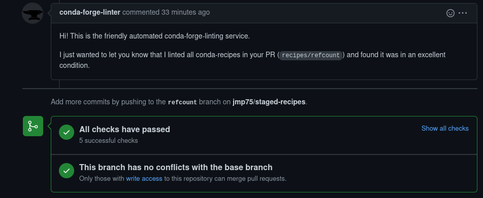

---
aliases:
- /conda/conda-forge/recipes/2022/06/04/conda-packages-conda-forge
author: <a href='https://github.com/jmp75'>J-M</a>
categories:
- recipes
- conda
- conda-forge
date: '2022-06-04'
description: Journey in building my first conda package and ending up submitting to
  conda-forge
draft: false
image: https://docs.conda.io/en/latest/_images/conda_logo.svg
layout: post
title: Submitting your first conda package to conda-forge
toc: true

---

# Background

For years I've been contributing to and maintaining, at work, a [software stack for streamflow forecasting](https://github.com/csiro-hydroinformatics/streamflow-forecasting-tools-onboard/). It is a stack with a core in C++, but accessible via a C API by users from R, Matlab, Python and so on. A whole article could be written about the design rationale, successes and shortcomings of this stack, and the interplay of people, organisations and technologies in using these tools and how. But this will not be this post.

Focussing on the Python side of things, these streamflow forecasting tools are used mostly on Windows and Linux, the core is deployed as dynamic libraries (.dll or .so) on disk, and python packages access these using [cffi](https://cffi.readthedocs.io) for interoperability. The python packages contain solely python code; there is no cython or straight C.

I've come to appreciate (mostly) conda environments for managing software stacks for various projects. This post is a start to test packaging some of "my" software with conda, in the hope this reduces the surprisingly strong impedance, technical but not only, towards usage by a broader audience.

A bit picture end point would be a corporate equivalent to a conda-forge channel, with the full software stack available for any employee.

# Baby steps

I had a look a few weeks ago at how I'd package a substantial but relatively small C++ code [MOIRAI: Manage C++ Objects's lifetime when exposed through a C API](https://github.com/csiro-hydroinformatics/moirai/tree/conda). This proved a bit premature for reasons I won't detail.

So, let's (re)start with a python-only library, as it happens in the same vein, [refcount](https://github.com/csiro-hydroinformatics/pyrefcount). Astonishingly, there is still no strict equivalent that I can find in conda-forge dedicated to reference counting external pointers. So, can I claim the spot?

# Resources

I started this post thinking first about conda packaging rather than submission _per se_ to conda-forge. Some resources I initially looked at as promising, **but from which I backed away** (for now):

* [Building conda packages from scratch](https://docs.conda.io/projects/conda-build/en/latest/user-guide/tutorials/build-pkgs.html)
* [python packaging tutorials Scipy 2018 Tutorial: The Joy of Packaging - conda packages](https://python-packaging-tutorial.readthedocs.io/en/latest/conda.html)
* [Activision Game: A tutorial (+ build recipes) describing how to use conda for C, C++, and python package management](https://github.com/ActivisionGameScience/ags_conda_recipes) outlines well the rationale for packaging in conda, and appears didactic. It appears not to have recent commit, although it is not necessarily a problem.

You'll see in the walkthrough below (next section) that I reoriented towards an upfront submission to conda-forge:

* [3 simple stept to build a python package for conda-forge](https://gallon.me/3-simple-steps-to-build-a-python-package-for-conda-forge/). This post really got me on a better path.
* [conda-forge documentation: Contributing packages](https://conda-forge.org/docs/maintainer/adding_pkgs.html#)

# Walkthrough

## First trial: `conda build` locally?

Of course python is necessary and a conda environment a given. I do `. ~/config/baseconda` because I **never** have conda activated by default from `.bashrc`.

I am actually not sure from the [conda-build tutorial](https://docs.conda.io/projects/conda-build/en/latest/install-conda-build.html) in which environment I should install conda-build. Let's try the base environment and see whether we get stuck or not.

`mamba install -c conda-forge conda-build` (installing from conda-forge is an idiosyncrasy. I strongly recommend [mamba](https://mamba.readthedocs.io/en/latest/))

You should at least skim through the [concepts](https://docs.conda.io/projects/conda-build/en/latest/concepts/index.html#). This is rather dry to read throughly upfront.

The tutorial [Building conda packages from scratch](https://docs.conda.io/projects/conda-build/en/latest/user-guide/tutorials/build-pkgs.html) quickly confused me; I was trying to transpose it to `refcount` but this does not look like the right template to start from. The section [editing-the-meta-yaml-file](https://docs.conda.io/projects/conda-build/en/latest/user-guide/tutorials/build-pkgs.html#editing-the-meta-yaml-file) appears out of sync with the "correct" meta.yaml file. Baffling.

## Preparing a PR to conda-forge/staged-recipes

Enter two new resources: [3 simple stept to build a python package for conda-forge](https://gallon.me/3-simple-steps-to-build-a-python-package-for-conda-forge/) and [conda-forge documentation: Contributing packages](https://conda-forge.org/docs/maintainer/adding_pkgs.html#). From these it becomes clear I should use [`grayskull`](https://github.com/conda-incubator/grayskull#introduction) to get a starting point as a `meta.yaml` file

```sh
cd ~/src
git clone --depth 1 git@github.com:jmp75/staged-recipes.git
cd ~/src/staged-recipes/recipes
git remote add upstream git@github.com:conda-forge/staged-recipes.git
mamba install -c conda-forge grayskull
grayskull pypi refcount
```

```text
#### Initializing recipe for refcount (pypi) ####

Recovering metadata from pypi...
Starting the download of the sdist package refcount
refcount 100% Time:  0:00:00  15.3 MiB/s|###############################################################################################################################################################################################################################################|
Recovering information from setup.py
Executing injected distutils...
Recovering metadata from setup.cfg
No data was recovered from setup.py. Forcing to execute the setup.py as script
Recovering metadata from setup.cfg
Checking >> cffi 100% |##########################################################################################################################################################################################################################################|[Elapsed Time: 0:00:00]
Matching license file with database from Grayskull...
Match percentage of the license is 59%. Low match percentage could mean that the license was modified.
License type: BSD-3-Clause
License file: LICENSE.txt
Host requirements:
  - pip
  - python

Run requirements:
  - cffi
  - python

RED: Missing packages
GREEN: Packages available on conda-forge

Maintainers:
   - j-m

#### Recipe generated on /home/abcdef/src/staged-recipes/recipes for refcount ####
```

The output `meta.yaml`  (which is actually a ninja template file), is a good start, however you should revise it a bit rather than accept wholesale


Mostly fine, however this did not pick up a requirement `cffi >=1.11.5`, and second guessing from reading this gallon.me post, a minimum python version is necessary to get accepted.

```yaml
requirements:
  host:
    - pip
    - python >=3.6
  run:
    - cffi >=1.11.5
    - python >=3.6
```

Perhaps optional, remove a hard-coded package string "refcount "in the source url section.

It is instructive to look at the [existing pull requests on staged-recipes](https://github.com/conda-forge/staged-recipes/pulls). Notably I realise that the github ID extracted by grayskull is not the correct one; I am not the ID [j-m](https://github.com/j-m), unfortunately (could have been judging by history length).

```yaml
extra:
  recipe-maintainers:
    - j-m
```

```yaml
extra:
  recipe-maintainers:
    - jmp75
```

The end result should be something like:

<!-- NOTE: we need to use a 'raw' section; ninja2 things otherwise mess things up at rendering with Jekyll 
https://stackoverflow.com/questions/52324134/getting-an-liquid-exception-liquid-syntax-error-while-using-jekyll
-->

```yaml




package:
  name: {{ name|lower }}
  version: {{ version }}

source:
  url: https://pypi.io/packages/source/{{ name[0] }}/{{ name }}/{{ name }}-{{ version }}.zip
  sha256: bf8bfabdac6f0d9fe3734f1c1830fda8b9b2d740c90ecf8caf8c2ef3ed9c8442

build:
  noarch: python
  script: {{ PYTHON }} -m pip install . -vv
  number: 0

requirements:
  host:
    - pip
    - python >=3.6
  run:
    - cffi >=1.11.5
    - python >=3.6

test:
  imports:
    - refcount
  commands:
    - pip check
  requires:
    - pip

about:
  home: https://github.com/csiro-hydroinformatics/pyrefcount
  summary: A Python package for reference counting and interop with native pointers
  description: |
    This package helps you achieve reliable management of memory 
    allocated in native libraries, written for instance in C++. While 
    it boils down to "simply" maintaining a set of counters, 
    it is deceptively complicated to do so properly and not end up 
    with memory leaks or crashes.
    <https://pyrefcount.readthedocs.io/en/latest/>.
  dev_url: https://github.com/csiro-hydroinformatics/pyrefcount
  license: BSD-3-Clause
  license_family: BSD
  license_file: LICENSE.txt

extra:
  recipe-maintainers:
    - jmp75

```

So; ready to submit a pull request? Wait, wait.

## Building locally

[test](https://conda-forge.org/docs/maintainer/adding_pkgs.html#test) has a section on Running unit tests. Note that the default conda recipe above has a "pip check", but nothing more. `refcount` unit tests use pytest, and has unit tests; tick that. `refcount` is a pure python package, _but_ it is a package for (mostly) interoperability with native code via a C API. Unit tests do contain some c/c++ code.

Should the recipe run fine upon submission, including unit tests? Before submitting a pull request that may trigger a failed check, let's experiment with [staging tests locally](https://conda-forge.org/docs/maintainer/adding_pkgs.html#staging-test-locally).

so:

```sh
cd ~/src/staged-recipes
python ./build-locally.py linux64
```

```text
  File "/home/abcdef/miniconda/lib/python3.9/subprocess.py", line 373, in check_call
    raise CalledProcessError(retcode, cmd)
subprocess.CalledProcessError: Command '['.scripts/run_docker_build.sh']' returned non-zero exit status 1.
```

I tried to `conda install -c conda-forge shyaml` which seems to be used by the scripts, but this did not alleviate the issue.

That took me some time to find a workaround to this one. The "exit status 1" is actually very misleading. The root cause is a `docker run -it` that exited with an error code 139. I seem to not be the only one to have bumped into [this issue](https://github.com/conda-forge/staged-recipes/issues/18127) still open. I may have pointed to the workaround in the conda-forge FAQ.

I needed to override the default docker image build-locally.py falls back to with:

```sh
export DOCKER_IMAGE=quay.io/condaforge/linux-anvil-cos7-x86_64
python build-locally.py linux64
```

the build script works this time, but at some point:

```text
Processing $SRC_DIR
  Added file://$SRC_DIR to build tracker '/tmp/pip-build-tracker-bkn7ckr9'
  Running setup.py (path:$SRC_DIR/setup.py) egg_info for package from file://$SRC_DIR
  Created temporary directory: /tmp/pip-pip-egg-info-68li1y6t
  Preparing metadata (setup.py): started
  Running command python setup.py egg_info
  Traceback (most recent call last):
    File "<string>", line 2, in <module>
    File "<pip-setuptools-caller>", line 34, in <module>
    File "/home/conda/staged-recipes/build_artifacts/refcount_1654312313810/work/setup.py", line 41, in <module>
      with open(os.path.join(here, 'README.md'), encoding='utf-8') as f:
    File "/home/conda/staged-recipes/build_artifacts/refcount_1654312313810/_h_env_placehold_placehold_placehold_placehold_placehold_placehold_placehold_placehold_placehold_placehold_placehold_placehold_placehold_placehold_placehold_placehold_placehold_placehold_pl/lib/python3.10/codecs.py", line 905, in open
      file = builtins.open(filename, mode, buffering)
  FileNotFoundError: [Errno 2] No such file or directory: '/home/conda/staged-recipes/build_artifacts/refcount_1654312313810/work/README.md'
  error: subprocess-exited-with-error
  
  × python setup.py egg_info did not run successfully.
  │ exit code: 1
  ╰─> See above for output.
  
  note: This error originates from a subprocess, and is likely not a problem with pip.

```

This is an issue that may be in my control.

```sh
cd ~/src/staged-recipes/build_artifacts/refcount_1654312313810/work
ls
## build_env_setup.sh  conda_build.sh  LICENSE.txt  MANIFEST.in  metadata_conda_debug.yaml  PKG-INFO  README.rst  refcount  refcount.egg-info  setup.cfg  setup.py
```

`refcount` has both a `README.md` and `README.rst`, the latter being an export from the former because pypi requires (or used to require) a README.rst to display correctly. The [zip archive of the source code on pypi](https://files.pythonhosted.org/packages/10/16/d143a863a79fb1f386bd78178257f6d0a3d085fd740ca94cb19af54a76c9/refcount-0.9.3.zip) indeed does not have the `README.md` file included.

I've inherited the practice to use in the packages `setup.py` the following, to limit redundances.

```python
with open(os.path.join(here, 'README.md'), encoding='utf-8') as f:
    long_description = f.read()
    long_description_content_type='text/markdown'
```

Previously I needed to convert on the fly to restructured Text, but [Markdown is more supported](https://github.com/pypa/pypi-legacy/issues/148). Still there is a lot of inertia with restructuredText.

I may try to just nuke the README.rst. The only fly on the ointment is: is pypi ok with rendering markdown **correctly** these days? Probably; the [packaging documentation](https://packaging.python.org/en/latest/tutorials/packaging-projects/) is using README.md by default.

So, [build and submit](https://github.com/csiro-hydroinformatics/pyrefcount/blob/master/docs/tech_notes.md) to pypi the updated [refcount 0.9.4](https://pypi.org/project/refcount/0.9.4/) with no README.rst. Looks fine, including the zip source archive.

```text
RuntimeError: SHA256 mismatch: '21567918cb1bb30bf8116ce3483d3f431de202618eabbc6887b4814b40a3b94a' != 'bf8bfabdac6f0d9fe3734f1c1830fda8b9b2d740c90ecf8caf8c2ef3ed9c8442'
Traceback (most recent call last):
```

Right, I forgot to change the checksum in the meta.yaml file.

And... **it seems to complete**.

```text
import: 'refcount'
+ pip check
No broken requirements found.
+ exit 0

Resource usage statistics from testing refcount:
   Process count: 1
   CPU time: Sys=0:00:00.0, User=-
   Memory: 3.0M
   Disk usage: 28B
   Time elapsed: 0:00:02.1

TEST END: /home/conda/staged-recipes/build_artifacts/noarch/refcount-0.9.4-pyhd8ed1ab_0.tar.bz2
```

Submit the [pull request](https://github.com/conda-forge/staged-recipes/pull/19140), and pleasantly:



# Conclusion

While there were a couple of bumps along the way, this should end up with a positive outcome. If not with refcount on `conda-forge`, I've a better understanding to tackle conda packaging on the rest of the software stack.

* Building a conda package "from scratch" may not be the easiest learning path. Even if you indent to build a conda package not for conda-forge, going through the staged-recipes process may be a most
* Some of the reference documentation may need a spruice up. [Building conda packages from scratch](https://docs.conda.io/projects/conda-build/en/latest/user-guide/tutorials/build-pkgs.html) confused me. First, packaging a pypi package is not starting "from scratch" for most users. Second, inconsistencies in the documentation. I am sure I'll get back to that resource, but I wish there were more "water tight", step-by-step tutorials for conda packaging.
