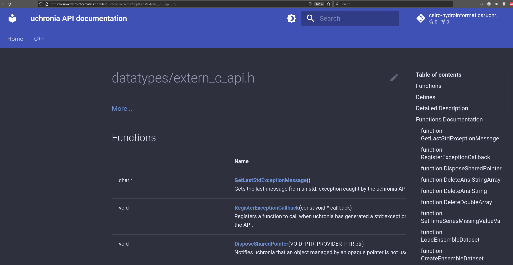

---
aliases:
- /C++/MkDocs/Python/documentation/2022/08/22/doxygen-doxybook-mkdocs
author: <a href='https://github.com/jmp75'>J-M</a>
categories:
- documentation
- C++
- Python
- MkDocs
date: '2022-08-22'
description: Convert doxygen C++ API documentation to Markdown with doxybook2, to
  generate a gorgeous site with MkDocs
draft: false
layout: post
title: Presenting doxygen C++ API documentation via MkDocs with doxybook2
toc: true

---

# Background

The codebase [Uchronia - time series handling for ensembles simulations and forecasts in C++](https://github.com/csiro-hydroinformatics/uchronia-time-series/) comprises a C++ core with Python and R bindings. The Python package documentation is using [MkDocs](https://www.mkdocs.org/) to generate its API documentation, in line with its dependencies [c-interop](https://github.com/csiro-hydroinformatics/c-interop) and [Python refcount](https://github.com/csiro-hydroinformatics/pyrefcount).

The C++ core is (to some extent) documented in the source code with formatted comments, and are extracted with [Doxygen](https://doxygen.nl/index.html), a long established de-facto standard.

While the Python, R and C++ parts of the code base usually address different types of users, I was wondering whether it is possible to host at least the Python and C++ API documentation jointly in a MkDocs based site. While it is somewhat subjective, one purpose is to host the documentation via a pleasant Web based interface such as [this](https://pyrefcount.readthedocs.io/en/latest/).

# Resources

Scouting for bridges between Doxygen and MkDocs, I found a few resources. The most active and adopted one appears to be [doxybook2](https://github.com/matusnovak/doxybook2). This appears worth a try on the Uchronia code base.

# Summary walkthrough

While I could host the documentation on github pages via the existing Uchronia codebase, to avoid growing its scope let us create a dedicated project [uchronia-ts-doc](https://github.com/csiro-hydroinformatics/uchronia-ts-doc).

## Installing software

Doxygen is mainstream and on a Debian linux available with `sudo apt install doxygen`

### doxybook2

doxybook2 has precompiled Windows binaries. For Linux, installing from the source code appears the way to go.

```sh
git clone --depth=1 https://github.com/matusnovak/doxybook2.git
cd doxybook2/
```

The instructions are to use Microsoft vcpkg to manage dependencies, which worried me at first. Usually I would assume dependencies would be available via `apt`, but the list `catch2 fmt dirent fmt nlohmann-json inja cxxopts spdlog` makes me think there would be some not readily available. But, vcpkg appears to be multi-platform these days; I had not looked closely for years. Let's give it a try.

```sh
cd $HOME/src
git clone https://github.com/microsoft/vcpkg
./vcpkg/bootstrap-vcpkg.sh
```

This appears to work fine.

Now on to building `doxybook2`. I had to adjust a bit the instructions given by the doxybook2 Readme. There are probably some assumptions as to how vcpkg was bootstrapped, perhaps with `sudo`. Anyway, figuring out was not that difficult; I had to `locate vcpkg.cmake`, and the executable doxybook2 output was not in the place I expected it to be.

```sh
cmake -B ./build -G "Unix Makefiles"     -DCMAKE_BUILD_TYPE=MinSizeRel     -DCMAKE_TOOLCHAIN_FILE=${HOME}/src/vcpkg/scripts/buildsystems/vcpkg.cmake
cmake --build ./build --config MinSizeRel  # could do with a -j4 perhaps
${HOME}/src/doxybook2/build/src/DoxybookCli/doxybook2 --help
```

Let's define a shorcut:

```sh
DX2=${HOME}/src/doxybook2/build/src/DoxybookCli/doxybook2
```

## Configuration

### Doxygen settings

Adjust the doxygen settings in the [Doxyfile](https://github.com/csiro-hydroinformatics/uchronia-ts-doc/blob/main/Doxyfile). Below are some settings changed compared to the default config file, some found only after the fact (i.e. seeing the final output through MkDocs).

```text
PROJECT_NAME           = "uchronia"
###  Also PROJECT_BRIEF, etc.
OUTPUT_DIRECTORY       = "./doxyoutput"
###
INPUT   = ../datatypes/datatypes/include/datatypes
###
FULL_PATH_NAMES        = NO
###
INPUT_FILTER           = " sed 's/^\s*DATATYPES_API\s*//g;s/^\s*DATATYPES_DLL_LIB\s*//g;s/DATATYPES_DLL_LIB//g' "
###
GENERATE_XML           = YES
###
XML_OUTPUT             = xml
```

`FULL_PATH_NAMES = NO` is useful to avoid having your full machine-specific file paths shown in the resulting output. `INPUT_FILTER` is less obvious, and relate to one technique in C libraries that may not be all that unusual (since derived from a Microsoft best practice as I recall). `uchronia` headers use macros such as `#define DATATYPES_DLL_LIB __declspec(dllexport)` on Windows, necessary to define which functions are exported (or imported). This results in C / C++ code such as :

```C++
	DATATYPES_API char** GetEnsembleDatasetDataIdentifiers(ENSEMBLE_DATA_SET_PTR dataLibrary, int* size);
    //, or:
    class DATATYPES_DLL_LIB TimeSeriesChecks{
        //
    }
```

This confuses doxygen and/or doxybook2, resulting in noisy or even incorrect rendered HTML output. `INPUT_FILTER` is here to strip out these macros prior to parsing. You may need to find such statement for your library. Consider using [regex101](https://regex101.com/) if you, like me, are shamefully not on top of regular expressions.

```sh
doxygen Doxyfile
```

### doxybook2 settings

The doxybook2 repo suggests looking at the [MkDocs + Material theme example](https://github.com/matusnovak/doxybook2/tree/master/example/mkdocs-material), as this is the theme I use.

The [config-doxybook2.json](https://github.com/csiro-hydroinformatics/uchronia-ts-doc/blob/main/config-doxybook2.json) requires one change for the links. It took me a few trial and errors to figure out that I needed to set `"baseUrl": "/uchronia-ts-doc/cpp/"` for URL links to work in the final API documentation generated on github pages.

```json
{
  "baseUrl": "/uchronia-ts-doc/cpp/",
  "indexInFolders": true,
  "linkSuffix": "/",
  "indexClassesName": "index",
  "indexFilesName": "index",
  "indexGroupsName": "index",
  "indexNamespacesName": "index",
  "indexRelatedPagesName": "index",
  "indexExamplesName": "index",
  "mainPageInRoot": true,
  "mainPageName": "index"
}
```

This `"baseUrl": "/uchronia-ts-doc/cpp/"` deserves a bit of an explanation so that you hopefully don't have to trial much (it is not rocket science, but...).

The markdown documentation for the site will be located under a `docs` folder, the mkdocs default. The C++ derived markdown documents will be under a subfolder `docs/cpp`. doxygen did not know about this upfront (though there may be a way to do it, but nevermind), so doxybook2 is where this prefix can be added to building URLs.

The MkDocs settings `mkdocs.yml` will have a `site_url: https://csiro-hydroinformatics.github.io/uchronia-ts-doc/` specified. See the [MkDocs configuration doc](https://www.mkdocs.org/user-guide/configuration/#site_url) for explanations. To be honest I am very sketchy in Web URL things, and not sure how to explain reliably what is going on in detail. Just know that `"baseUrl": "/uchronia-ts-doc/cpp/"` was required in the doxybook2 config file, with leading and trailing `/` characters, for links to work. I hope this helps you speed up finding your own exact settings.

### Running doxybook2

So, our `doxygen Doxyfile` has created a `doxyoutput` folder. Now let us convert to markdown:

```sh
mkdir -p docs/cpp
$DX2 --input ./doxyoutput/xml --output ./docs/cpp --config config-doxybook2.json
```

```sh
# . ~/config/baseconda
# conda activate mkdocsenv
mkdocs build --clean --site-dir _build/html --config-file mkdocs.yml
mkdocs serve
```

## Finally

Updating the github pages site is simply:

```sh
mkdocs gh-deploy --clean --site-dir _build/html --config-file mkdocs.yml
```

Some rough corners left, but it largely works:

[](https://csiro-hydroinformatics.github.io/uchronia-ts-doc)
